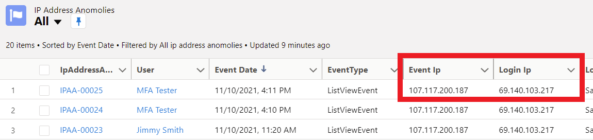
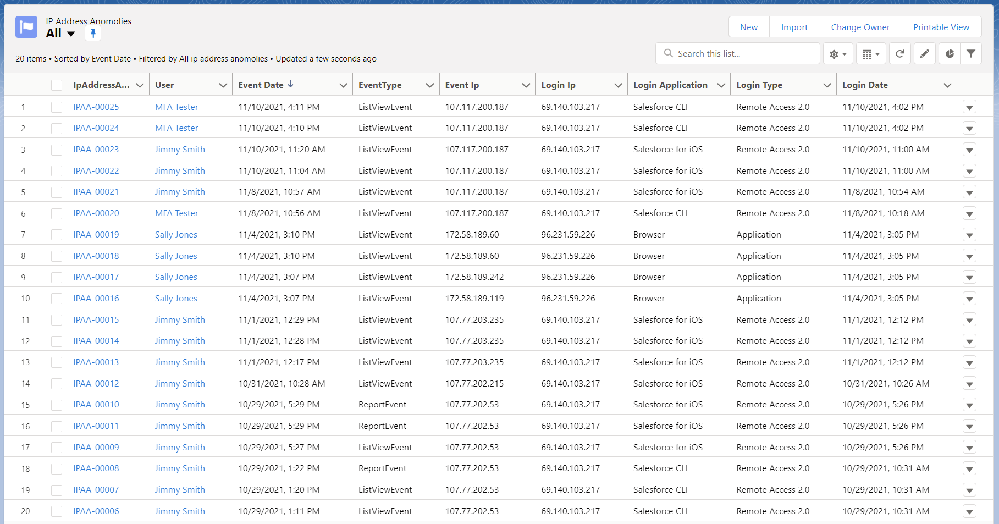

# Salesforce IP Address Anomaly Tracking

Code for detecting and logging IP address anomalies. This uses the Transaction Security Policies process to determine if a session is being used from an IP address different than the login IP Address





## Creating the scratch org

```bash
sfdx force:org:create --definitionfile config/ip-anomaly-scratch-def.json --durationdays 30 --setalias IpAnomalyScr edition=Developer --targetdevhubusername JMA-CliSec
```

## Custom Objects

### IpAddressAnomaly\_\_c

- **Description:** Stores IP Address Anomalies. Events are stored here when the Login IP is different than the Event IP. Apps can be excluded from tracking by adding them to the IpIgnoreAppSetting\_\_c custom setting object.
- **Label:** IP Address Anomaly
- **Plural Label:** IP Address Anomalies
- **Sharing Model:** ReadWrite
- **External Sharing Model:** Private
- **Name Field:**
  - **Label:** IpAddressAnomaly Name
  - **Type:** AutoNumber
  - **Display Format:** `IPAA-{00000}`

## Fields

| Label             | Name                  | Type     | Description                                                                                                                                                                                                                                                                                                                                                                                                                         | Required |
| ----------------- | --------------------- | -------- | ----------------------------------------------------------------------------------------------------------------------------------------------------------------------------------------------------------------------------------------------------------------------------------------------------------------------------------------------------------------------------------------------------------------------------------- | -------- |
| Event Date        | EventDate\_\_c        | DateTime | The time of the specified event. For example, 2020-01-20T19:12:26.965Z. Milliseconds are the most granular setting.                                                                                                                                                                                                                                                                                                                 | false    |
| Event Identifier  | EventIdentifier\_\_c  | Text     | The unique identifier for each record in Event. Use this field as the primary key in your queries.                                                                                                                                                                                                                                                                                                                                  | true     |
| Event Ip          | EventIp\_\_c          | Text     | The source IP address of the event. For example, 126.7.4.2.                                                                                                                                                                                                                                                                                                                                                                         | true     |
| EventType         | EventType\_\_c        | Text     | The type of the platform event which fired the policy (ApiEvent, BulkApiResultEvent, ListViewEvent, ReportEvent)                                                                                                                                                                                                                                                                                                                    | true     |
| Login Application | LoginApplication\_\_c | Text     | Name of the app used to login, such as "Salesforce for iOS", "Salesforce CLI", etc.                                                                                                                                                                                                                                                                                                                                                 | false    |
| Login Date        | LoginDate\_\_c        | DateTime | The login time of the specified event. For example, 2020-01-20T19:12:26.965Z. Milliseconds are the most granular setting.                                                                                                                                                                                                                                                                                                           | false    |
| Login History Id  | LoginHistoryId\_\_c   | Text     | Tracks a user session so you can correlate user activity with a particular series of report events. This field is also available on the LoginEvent, AuthSession, and LoginHistory objects, making it easier to trace events back to a user’s original authentication. This value is null if the event that was generated was from a dashboard refresh, a multi-block report, or a scheduled report. For example, 0YaB000002knVQLKA2. | false    |
| Login Ip          | LoginIp\_\_c          | Text     | The source IP address of the client logging in. For example, 126.7.4.2.                                                                                                                                                                                                                                                                                                                                                             | true     |
| Login Key         | LoginKey\_\_c         | Text     |                                                                                                                                                                                                                                                                                                                                                                                                                                     | false    |
| Login Type        | LoginType\_\_c        | Text     | The type of login used to access the session.                                                                                                                                                                                                                                                                                                                                                                                       | false    |
| Session Key       | SessionKey\_\_c       | Text     | The user's unique session ID. Use this value to identify all user events within a session. When a user logs out and logs in again, a new session is started. This value is null if the event that was generated was from a dashboard refresh, a multi-block report, or a scheduled report. For example, vMASKIU6AxEr+Op5.                                                                                                           | false    |
| User              | User\_\_c             | Lookup   | Lookup to the origin username in the format of user@company.com at the time the event was created.                                                                                                                                                                                                                                                                                                                                  | false    |
